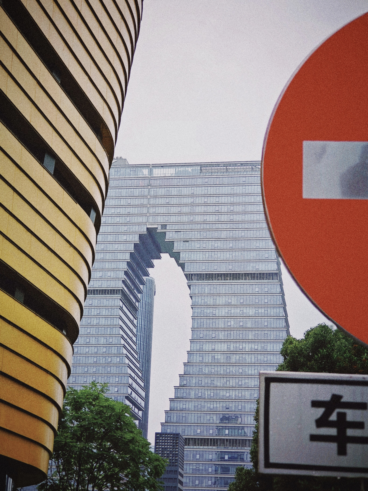

## 6 月 24 日

推进雅思英语词汇，用的不背单词。还差正好 2000 个。

重新学一遍线性代数，用的 [3B1B 线性代数本质](https://www.bilibili.com/video/BV1ys411472E?p=8&vd_source=761f7d019a0848a165a93faf761026f3)，看到 8/16，Manim 真是神奇。

两个学期下来太狗屎了，没时间好好学，狗屁应试。考前挑着看了经典 MIT 线性代数系列，速通成功。虽然到最后 Jordan 标准型的类型题一半不会写，Hermite 矩阵是啥也忘了，Hamilton-Cayley 定理正好没复习。

培养方案真是误人子弟。勉强及格的话，绩点就会完蛋。大学的实验班太脑瘫了，不适合我。急需实习挣钱，别说暑研了，就算申上暑研，路费都出不起。所以需要学习更多 CS 技能。

走学院派路线太死板了。我知道那些公开课是好课。但这又非常矛盾，实验班课程难度更大，想获得好看的绩点和排名需要下苦功夫，而我又不想在 EE 上浪费太多时间。

与其责备自己，不如批判他人，拒绝情绪低迷。

还是想办法找到实习挣钱要紧。明天重新入门  React，我们的老朋友。

## 6 月 25 日

蛋总深夜找我，大家都遇到了一些苦难。但我相信眼前的挫折如果放大到人生的尺度上根本不算什么。就算只是小小的波动，每一处壁垒并非难以逾越。

推进雅思英语词汇，还剩 1985 个，复习了很久。

3B1B 的线性代数看完了（16/16）。

最后看了一下 Deep Learning 和 Data Analysis 的学习路径，感觉和自己在 CIS 课上学的差不多，应该算是有基础了，该搞点项目出来丰富一下履历。

React 还没碰，但是应该不急。

## 6 月 26 日

推进雅思英语词汇，还剩 1965 个。

投递了三份简历，没有抱太大期望。继续探索可能性。

一整天做的事情很少，看了很久狐妖小红娘，温故。

遇到了不少糟糕的事，家庭上的、人际上的，感觉现在的环境很 toxic，急需改变。我不该和他们呆在一起。氛围很差，空气里弥漫的都是负能量。我觉得我比他们强，并非应试的，而是综合素质：从英语，到 CS 技能，再到沟通能力。这点在我看到舍友邋遢的生活态度后更加笃定无疑。

我总是浸溺在懊悔和遗憾的沉重之中。我不该在这里，而他们设置的条条框框毫无意义。凭什么我不能拥有风花雪月？明明世界的大门在向我敞开。如果家庭条件再富裕一点就好了。

对广东充满滤镜。一是因为那里是我的故乡，二是我所期待的邂逅在广东发生的概率更大。我讨厌迂腐和陈旧的城市，哪怕是冠以“文化遗产”，我依然视之糟粕。每每路过胡同或者苏联时的破楼，我心里总会泛起恐惧，害怕被他们的黯淡吞噬。

逃离的愿望愈发强烈。

## 6 月 27 日

推进雅思英语词汇，还剩 1945 个。

放空自己的时候又开始被懊悔的情绪占据。思考未来该怎么规划、该怎么做、如何在已经做错的选择上不再错上加错。

简历邮件杳无音讯。

ETH Zurich 的数字电路公开课稍微看了一下，看到 3/34，组合逻辑之前。

对于 PC 记笔记的效率存疑。要不要以后纯手写知识库？毕竟 S Pen 也不能白瞎了。比起用 LaTex 和 Markdown 一板一眼地记录，手写的效率更高吧。笔记这东西也是给自己看的。

高中最不喜欢的公子哥休学了。讽刺的是休学后他的学习时间比我长，而且他在学一些公开课。这让我产生了危机感。

## 6 月 28 日

推进雅思英语词汇，还剩 1905 个。

借由学院社会实践的契机来杭州玩。杭州很现代化，虽然乌云总是不合时宜地占据画幅，精致的建筑却能让人耳目一新。

记得上一次来杭州已经是十年前了，感慨万千。西湖倒是因为下雨显得游客稀疏，难得多了几分闲适安逸。小米的摄影是真的不行，我只能套上胶卷的预设来掩盖画面模糊的事实。攒够钱买台尼康或者索尼的老微单。

同学里去苏州中外合办上学的，已经在普华永道实习结束了，真是了不起，也更真切地了解到各方面的资源有多重要。当年班里还有男生瞧不起那位女同学，真是可怜。

了解到自己想要什么就需要结实地去做。