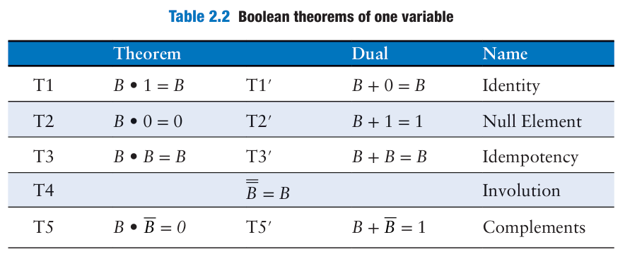
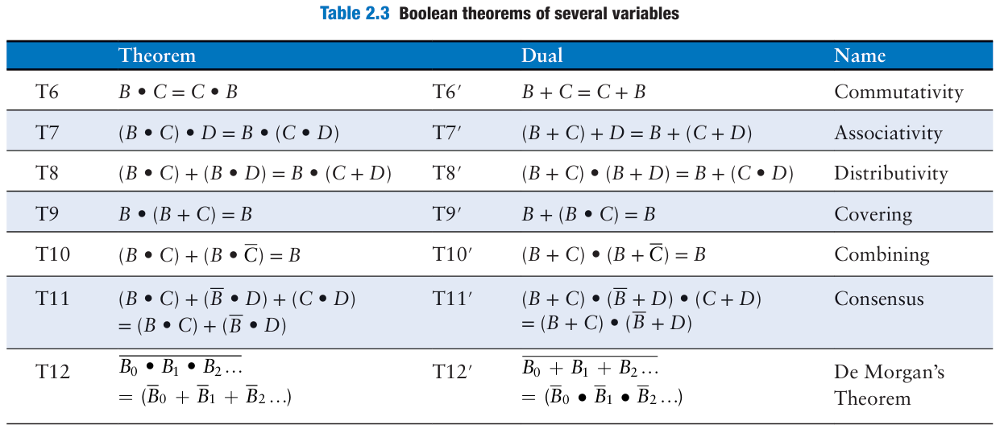

# 第一章

## 数字系统

### 原码

原码（Sign/Magnitude Number）的第一位表示正负，0 为正，1 为负。例如 5 的二进制为 101，则 -5 的四位二进制原码为 1101。

### 补码

补码（Two\'s Complement），将每位数字取反然后末尾加 1。例如 2 = 0010，则 -2 = 1101 末尾加 1，为1110。

补码可以方便二进制的运算，使用最为广泛。

## 逻辑门

|     Gates      | 意义                                             |
| :------------: | ------------------------------------------------ |
|  与门（AND）   | 当且仅当所有输入都为真时，输出才为真。           |
|  非门（NOT）   | 当输入为假时，输出为真；当输入为真时，输出为假。 |
|   或门（OR）   | 当至少一个输入为真时，输出才为真。               |
|  异或门 (XOR)  | 当输入不同时，输出才为真。                       |
| 同或门（XNOR） | 当输入相同时，输出才为真。                       |
| 与非门（NAND） | 与门的非门。                                     |
| 或非门（NOR）  | 或门的非门。                                     |

同时也需要记忆各门的图形：P44

## 数字抽象的深层含义

数字电路使用离散值，而物理值一般是连续的，所以电路设计者要想办法把离散值和连续值对应起来。

### 供电电压

零伏特电压一般指的是接地（GND）。从上世纪 70 年代起，供电电压从 5V 降到了 1.2V 以下。

### 逻辑电平

逻辑电平是指数字电路中电信号的电压水平，用于表示逻辑状态。在数字电路中，通常将电压分为两个离散的状态，分别代表逻辑值 0 和逻辑值 1。

### 噪声裕度

表示可以容忍的电压差值：

$$
NM_{L} = V_{IL} - V_{OL}
$$
$$
NM_{H} = V_{OH} - V_{IH}
$$

### 直流传输特性

将输入电压作为自变量，将输出电压作为因变量，抽象出一个函数。其形成的图像很有特点，叫作直流传输特性（DC Transfer Characteristics）。图像请参阅原书。

### 静态电路法则

静态电路法则要求，在给定逻辑上有效的输入情况下，每个电路元件都将产生逻辑上有效的输出。

为了提高生产力，诞生了四个逻辑家族：

- TTL
- CMOS
- LVTTL
- LVCMOS

# 第二章

## 布尔方程式

变量的反（Complement）：
$A \rArr \overline{A}$，不代表$A$就是 True，只是有无横线。

与项（AND）：乘法。最小项（minterm）是包含所有输入变量的与项

或项（OR）：加法。最大项（maxterm）是包含所有输入变量的或项

析取范式（Sum of Products）：积之和。$Y = AB + CD$。

合取范式（Product of Sums）：和之积。$Y = (A + B)(C + D)$。

## 布尔代数式

两张表格，记忆即可：

注意最后一行的德·摩根定律，数电中很有用：

$$
\overline{Y} = \overline{AB} + \overline{A}B
\\
\overline{\overline{Y}} = \overline{\overline{AB}} + \overline{\overline{AB}} = (\overline{AB})(\overline{AB}) = (A + B)(A + B)
$$

## 从逻辑到门