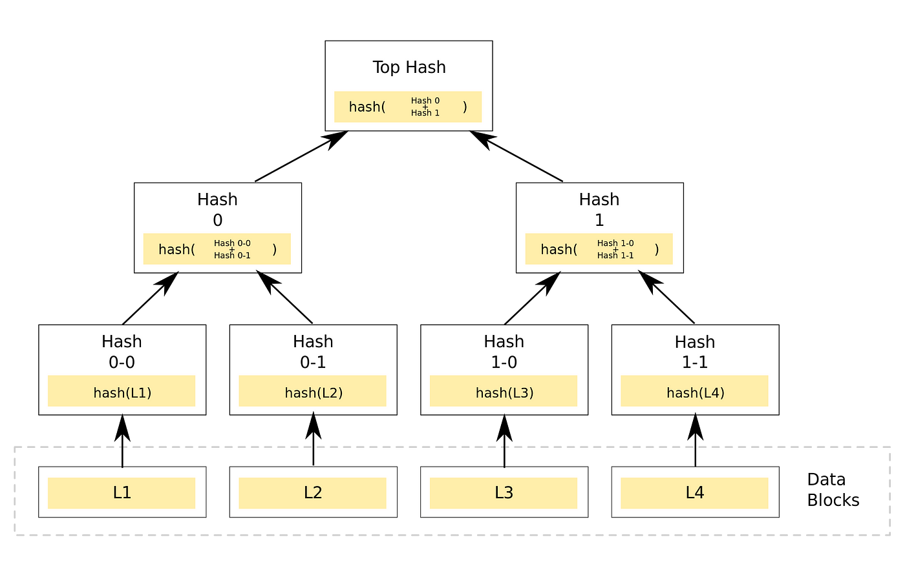

# 密码学基础

哈希函数的三个特点：

1. 单向性（One-Wayness）：$X \rightarrow H(X)$。
2. 唯一性（Uniqueness）：$X$ 只对应一个 $H(X)$。
3. 抗碰撞性（Collision Resistance）：不存在 $H(X) = H(Y)$。

# 数据结构

最重要的**哈希树**（Merkle Tree）结构。

# 区块链实现

**UTXO**（Unspent Transaction Output）：所有没被花掉的交易的输出。全节点要在内存中维护 UTXO，以便快速检验是否存在 Double Spending。

# 网络

1. 比特币网络使用 P2P 和 TCP，便于穿透防火墙。
2. 比特币对区块有 1M 字节的限制。

# 挖矿难度

1. 挖矿原理：$$ Hash(Block \ Header) \leq Target $$

2. 比特币采用 SHA-256 算法，也就是说目标值有 $2^{256}$ 个取值。

3. 挖矿难度：$$ Difficulty = \frac{Difficulty^{=1} \ Target}{Target} $$ 

4. 限制出块时间。出块时间太短：容易改链。

5. 比特币规定每隔 2016 个区块要调整阈值。目标阈值迭代更新方法：

$$ Target=Target \times \frac{Actual \ Time}{Expected \ Time} $$  

$$ Expected \ Time = 2016 \times 10 \ min/block $$ 

6. 挖矿难度用 nBits 格式存储，包含在区块头中。

7. 比特币系统中的参数可能只在中本聪的一念之间。 

# 挖矿

| 轻节点 | 全节点 |
|---|---|
| 不一定在线 | 一直在线 |
| 不用保存整个区块链，只要保存每个区块的区块头 | 在本地硬盘上维护完整的区块链信息 |
| 不用保存全部交易，只保存与自己相关的交易 | 在内存里维护 UTXO 集合，以极快速度验证交易的正确性 |
| 无法验证大多数交易的合法性，只能验证与自己相关的那些交易的合法性 | 监听比特币网络上的交易信息，验证每个交易的合法性 |
| 无法检测网上发布的区块的正确性 | 决定哪些交易会打包到区块里 |
| 可以验证好的难度 | 监听别的矿工挖出来的区块，验证其合法性 |
| 只能检测哪个是最长链，不知道哪个是最长合法链 | 挖矿（选择链分支） |

**ASIC**（Application Specific Integrated Circuit）：专门为挖矿而生的芯片。现在的挖矿难度用 GPU 已经划不来了。有的加密货币还提出 Alternative Puzzle 来抵抗 ASIC 挖矿。

**矿池**：矿主分配任务，矿工提交 Almost Vaild Block 给矿主来计算工作量。

